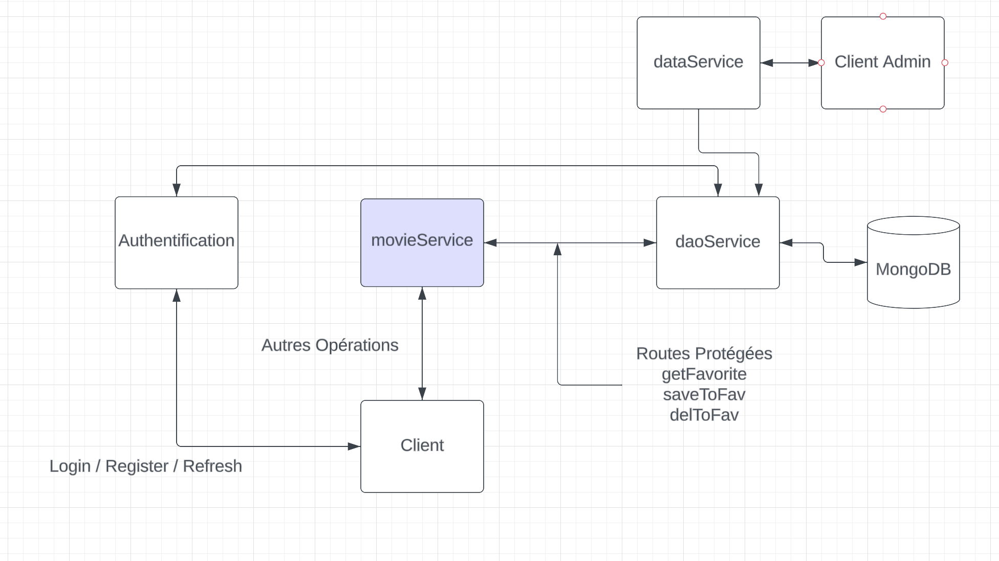

# SoA-MobileMovies
A modular and scalable backend service based on a service oriented architecture, allowing you to visualize the most popular movies of the moment, search by title and save them to a watch later list.

Un service modulaire et évolutif basé sur une architecture orientée services, permettant de visualiser les films les plus populaires du moment, de les rechercher par titre et de les enregistrer dans une liste de visionnage ultérieur.

